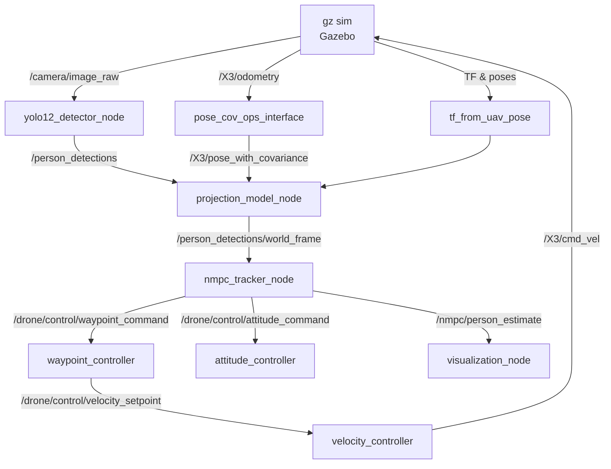

# AVIANS 无人机多传感器跟踪系统技术综述

> 供AI 10–15 分钟项目汇报 PPT 的原始素材。内容覆盖 `~/AVIANS_ROS2` 与 `~/AVIANS_PX4` 两个工作空间的核心代码架构、算法流程、节点互联关系以及后续工作计划。阅读后应能复刻现有实现。

---

## 1. 系统概览

- **总体目标**：实现一套在仿真与实机均可运行的“无人机跟踪行人”系统。上层（Jetson Orin NX）运行 ROS2 感知 + 规划 + SLAM，下层（Pixhawk 6X）运行 PX4 固件并提供冗余安全导航。
- **硬件部署**：
  - ROS2 侧：Jetson Orin NX，负责摄像头前端、YOLO 行人检测、3D 重投影、NMPC 轨迹生成、状态机。
  - PX4 侧：Pixhawk 6X，负责电机控制、光流 + 超声波 + EKF2 融合、碰撞防护、ROS2 指令失效时的降级导航。
- **工作流程**：
  1. 仿真（Gazebo, Option 5）验证全链路。
  2. PX4 HITL + uXRCE-DDS 验证 ROS2→PX4 指令闭环。
  3. 实机飞行，ROS2 负责高级功能，PX4 监控并接管应急。

---

## 2. ROS2 工作空间 (`~/AVIANS_ROS2`)

### 2.1 构建与运行

```bash
cd ~/AVIANS_ROS2
source /opt/ros/jazzy/setup.bash
colcon build --symlink-install
source install/setup.bash
./comprehensive_test_suite.sh   # 进入交互式菜单
```

### 2.2 Option 5（Full Integration Test）的 12 步启动序列

摘自 `comprehensive_test_suite.sh:352-519`：

1. Gazebo 环境（`drone_description/gz.launch.py`）：加载 X3 无人机 + `walking_person`。
2. `neural_network_detector/yolo12_detector_node`：YOLOv5n onnx 人体检测。
3. `neural_network_detector/detection_visualizer_node`：可选调试图像发布。
4. `drone_tf_publisher.py`：补齐 TF tree 以驱动 RViz。
5. `visualization_node.py`：绘制轨迹、检测框等 Marker。
6. `drone_state_publisher`：将 `/X3/odometry` 转换为 `/X3/pose_with_covariance`。
7. `tf_from_uav_pose`：维护世界系 → 机体系 → 相机系 TF。
8. `projection_model`：将 YOLO 像素框投影成世界坐标。
9. `pose_cov_ops_interface`：给无协方差的 Pose 加协方差矩阵。
10. `drone_nmpc_tracker/nmpc_tracker_node`：NMPC 跟踪控制 + 高层状态机。
11. `drone_low_level_controllers`（waypoint/attitude/velocity）三级 PID。
12. `ros2 topic pub /X3/enable` & `/nmpc/enable`：解锁无人机控制与 NMPC。

### 2.3 关键节点与话题

| 模块 | 节点 | 订阅 | 发布 | 说明 |
| --- | --- | --- | --- | --- |
| Gazebo | `gz sim` | - | `/camera/image_raw`, `/X3/odometry` | 仿真环境，输出传感器、姿态 |
| YOLO | `yolo12_detector_node` (`neural_network_detector/src/yolo12_detector_node.cpp`) | `/camera/image_raw` | `/person_detections`, `/person_detection_count`, `debug_image` | ONNX Runtime，支持 GPU/CPU，限频输出 |
| 投影 | `projection_model_node` (`projection_model/src/Projector.cpp`) | `/person_detections`, `/X3/pose_with_covariance`, `/machine_1/camera/pose(_optical)` | `/person_detections/world_frame`, `/neural_network_feedback` | 估计行人三维位置及协方差 |
| 状态桥 | `pose_cov_ops_interface_node` | `/X3/odometry` | `/X3/pose_with_covariance` | 添加协方差，供投影模型与 NMPC 使用 |
| NMPC | `nmpc_tracker_node` (`drone_nmpc_tracker/nmpc_node.py`) | `/person_detections/world_frame`, `/X3/odometry`, `/nmpc/enable` 等 | `/drone/control/waypoint_command`, `/drone/control/attitude_command`, `/nmpc/person_estimate`, `/drone/controller/status` | 状态机 + NMPC 优化（`nmpc_controller.py`） |
| 低层控制 | `waypoint_controller.py` / `attitude_controller.py` / `velocity_controller.py` | 上层控制话题 | `/drone/control/velocity_setpoint`, `/drone/control/angular_velocity_setpoint`, `/X3/cmd_vel` | 纯 Python PID，与 Gazebo 插件 `MulticopterVelocityControl` 对接 |
| 辅助 | `visualization_node.py`, `drone_tf_publisher.py` | 多话题 | Marker、TF | RViz 可视化 |

### 2.4 主要包与算法内容

#### (1) `drone_nmpc_tracker`

- **配置**：`config.py`（权重、边界、相机参数）。
- **优化求解**：`nmpc_controller.py`
  - 状态向量：位置、速度、Euler 角、角速度（12 维）。
  - 控制向量：推力 + roll/pitch 指令 + yaw rate。
  - 动力学：简化四旋翼模型，欧拉积分预测轨迹 (`predict_trajectory`)。
  - 代价函数组件：
    - 位置/速度误差（权重 `W_POSITION`, `W_VELOCITY`）。
    - 姿态/角速度保持（`W_ATTITUDE`, `W_ANGULAR_RATE`）。
    - 人体距离误差（`W_TRACKING_DISTANCE`，自适应加权）。
    - 相机朝向误差（`W_CAMERA_ANGLE`）。
    - 光滑度（目标位移平方和 `W_SMOOTH_TRACKING`）。
    - 控制能量（`W_CONTROL`）。
  - 求解策略：梯度下降 + 有限差分梯度 (`compute_gradient`) + warm start。
- **状态机**：`nmpc_node.py`
  - 状态：`TAKEOFF` → `SEARCH` → `TRACK` → `LOST_HOLD`；丢失目标后可返回 `SEARCH`。
  - 检测管线：接收 `/person_detections/world_frame`，Catmull–Rom 风格指数滤波，估计速度。
  - 姿态命令：`_compute_camera_alignment_offsets` 自适应 roll/pitch/yaw（视角居中）；`_apply_attitude_smoothing` 滑动限制。
  - 控制输出：`PoseStamped` + `Vector3Stamped`；`/nmpc/enable` 总开关。

#### (2) `drone_low_level_controllers`

三节点为 ROS2 实现的 PID：

- `waypoint_controller.py`：位置 → 速度 (NED)；含积分死区、限制 (`controllers.yaml` Lines 5-22)。
- `attitude_controller.py`：姿态 → 角速度；融合积分防飘 (`attitude_controller.py:143-215`)。
- `velocity_controller.py`：速度/角速度 → `/X3/cmd_vel` 体轴指令；QT quaternion 转换 (`velocity_controller.py:66-131`)。

仿真时，通过 Gazebo `multicopter_velocity_control` 接口执行；真实场景由 PX4 接手。

#### (3) 感知链路

- `neural_network_detector`：C++ 实现的 YOLOv5n 推理，基于 OpenCV DNN；支持反馈机制限制频率 (`yolo12_detector_node.cpp:95-155`)。
- `projection_model`：利用摄像机内参 (`camera_info`)、pose_cov 接口、人体高度模型完成射线投影；结果带协方差 (`Projector::detectionCallback3D`)。
- `target_tracker_distributed_kf`：可选分布式卡尔曼滤波（目前 Option 5 默认未启用，可在未来 PPT 中说明扩展）。
- `tf_from_uav_pose`：用 `/machine_1/pose` 构建 TF tree，确保投影模型能调用变换链。

#### (4) 其他辅助包

- `pose_cov_ops_interface`：为无协方差的 Odometry 生成协方差矩阵。
- `px4_bridge`：用于仿真阶段的命令桥接以及后期 HITL（若使用 uXRCE-DDS）。
- `ros2_utils/clock_sync`：统一仿真时间。

### 2.5 ROS2 节点关系图



---

## 3. PX4 工作空间 (`~/AVIANS_PX4`)

### 3.1 架构概览

- 源自 PX4 主干，加入 AVIANS 定制模块（位于 `src/modules`）。
- 与 ROS2 侧通过 uXRCE-DDS (`uxrce_dds_client`) 和自定义接口 (`avians_ros2_interface`) 交换 `trajectory_setpoint`、`vehicle_local_position`、`vehicle_status`。
- 在 HITL/实机模式下，PX4 的 `nav_and_controllers` 工作队列运行定制控制链（`avians_controllers`）以镜像 ROS2 的三级 PID，并实现降级导航。

### 3.2 重点模块

| 模块 | 源文件 | 功能摘要 |
| --- | --- | --- |
| `avians_ros2_interface` | `src/modules/avians_ros2_interface/avians_ros2_interface.cpp` | 100 Hz 轮询；从 `/fmu/in/trajectory_setpoint`（uXRCE）接收 ROS2 控制指令，做速度/姿态限幅后发布至 PX4 内部 topic；监控超时。 |
| `avians_controllers` | `src/modules/avians_controllers/avians_controllers.cpp` | 将 ROS2 的 Python 控制器移植到 PX4 C++：Waypoint → Velocity → Attitude → 最终 `vehicle_thrust_setpoint`/`vehicle_torque_setpoint`。若 500 ms 未收到指令自动零输出。 |
| `avians_i2c_esc` | I2C 外设驱动；与电调通信。 |
| `avians_controllers_params.c` | 通过参数系统暴露 PID、限幅、超时时间等。 |
| `avians_ros2_interface_params.c` | 设置速度、yaw rate 上限。 |
| `commander` / `flight_mode_manager` 扩展 | 为后续双状态机打基础（多态 `FlightTask` 扩展）。 |
| `uxrce_dds_client` | 微型 ROS2-RTPS 客户端，实现 ROS2 ↔ PX4 话题桥。 |

### 3.3 PX4 <-> ROS2 数据流

```mermaid
graph LR
    subgraph ROS2 (Jetson Orin NX)
        NMPC_R[NMPC Tracker]
        uXRCE_R[uxrce_dds_agent]
    end
    subgraph PX4 (Pixhawk 6X)
        uXRCE_P[uxrce_dds_client]
        ROS2_IF[avians_ros2_interface]
        CTRL[avians_controllers]
        SAFETY[commander / navigator / failsafes]
    end

    NMPC_R -->|trajectory_setpoint| uXRCE_R
    uXRCE_R -->|DDS| uXRCE_P
    uXRCE_P -->|vehicle_local_position| NMPC_R
    uXRCE_P --> ROS2_IF --> CTRL
    CTRL --> SAFETY -->|mode feedback| NMPC_R
```

### 3.4 待完成的 PX4 任务

与需求对应的代码位置/建议：

1. **HITL 测试**：`Tools/simulation/hitl` 脚本 + `px4_bridge`；测试脚本 `~/AVIANS_ROS2/pixhawk_hitl_test.sh`.
2. **双状态机**：在 `commander` + `flight_mode_manager` 中新增状态（ROS2 控制正常 ->`AVIANS_EXTERNAL`，异常 -> `RETURN`/`LAND`），需与 `navigator` 互通。
3. **光流 + 超声波融合**：扩展 `src/modules/ekf2` 传感器输入管线，或在 `local_position_estimator` 中融合 `vehicle_optical_flow`, `distance_sensor`，设置 failsafe 标志。
4. **碰撞预防**：可在 `navigator` 或 `mission` 管线中加入 `obstacle_distance` 检测，调用 `set_vehicle_constraints`.
5. **外部 IMU**：`src/drivers/mpu9250` 或创建 `avians_external_imu`，通过 uORB 发布 `sensor_combined`.
6. **ROS2 状态扩展**：在 ROS2 `nmpc_node.py` 中增加状态（识别、等待等），同步在 PX4 状态机中接入，确保 `avians_ros2_interface` 可透传状态信息。

---

## 4. 已完成工作与资源

- **代码迁移**：ROS1 → ROS2 的检测、投影、KF、NMPC、低层 PID 已完成。
- **仿真验证**：Option 5 提供一键启动脚本；`README_SIMULATION.md` 与 `project_summary.md` 记录关键步骤。
- **文档**：`NMPC_工作原理与路径点生成.md`、`低级控制器架构与实现原理.md`、`PX4_INTEGRATION_GUIDE.md` 等提供补充说明，可在 PPT 中引用。
- **测试脚本**：`test_odometry_fix.sh`, `test_oscillation_fix.sh`，用于单元测试与回归。

---

## 5. 后续工作计划（PPT 中“未来工作”章节）

1. `pixhawk_hitl_test.sh` 流程打通，确保 ROS2→PX4 指令闭环。
2. PX4 双状态机：正常模式镜像 ROS2，异常模式触发返航/降落，支持手动接管。
3. 光流 + 超声波融合：紧急导航 → 本地定位精度 & EKF2 参数调优。
4. 碰撞预防：在 PX4 侧创建安全气泡，防止在无感知时撞击。
5. 外部 IMU 接入：提高姿态冗余。
6. ROS2 状态机扩展：新增“识别”“等待”等任务状态，完善策略与超时处理。

---

## 6. 建议的 PPT 结构（再次总结）

1. 封面
2. 项目概览（目标、部署图）
3. ROS2 仿真链路（含 Option 5 步骤、节点图）
4. 核心算法（YOLO、投影、NMPC、PID）
5. PX4 架构与 ROS2 协同
6. 已完成成果
7. 即将开展的任务
8. 风险与应对（HITL、状态机同步、冗余导航）
9. 资源需求与合作
10. 结尾 / Q&A

---

## 7. 给豆包的改进版提示词

```
请根据《AVIANS_system_technical_brief.md》生成一份 10–15 分钟的项目进度汇报 PPT：
- 语言：中文
- 风格：简洁、信息量丰富、强调图示（节点图、流程图可直接参考文档中的 Mermaid 描述）
- 每页仅使用关键词或短语，不写长句
- 必须包含以下内容：
  1. 项目背景与目标
  2. 系统架构（ROS2 × PX4 协同，引用文档中的总体概览）
  3. ROS2 工作空间：Option 5 流程、各模块职责、核心算法亮点
  4. PX4 工作空间：自定义模块、数据流、HITL 计划
  5. 已完成成果与技术亮点
  6. 后续 6 项任务（HITL、状态机、传感器融合、碰撞预防、外部 IMU、ROS2 状态扩展）
  7. 风险与资源需求
  8. 总结与 Q&A
- 请在需要图形的页面使用图形或示意图（Mermaid 节点图可转化为流程示意）
- 色彩搭配建议：深蓝/灰白科技风，重点信息使用高亮（橙色或绿色）
```

