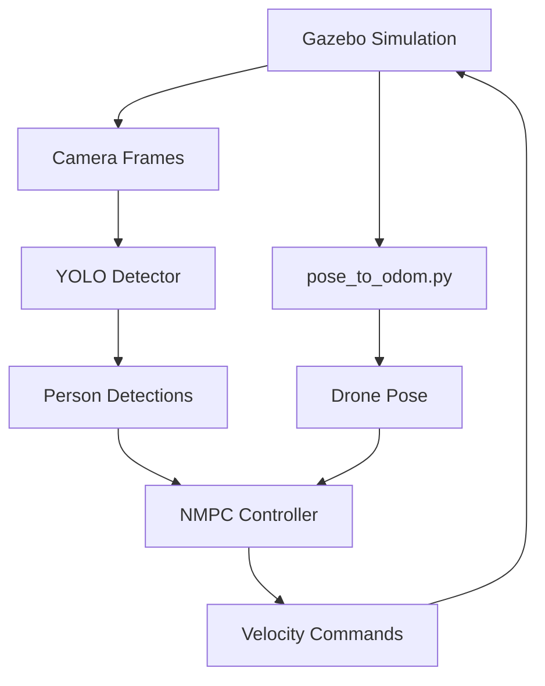

# 🚁 AVIANS ROS2: Autonomous Drone Mission Planning & Tracking System

     

## 📖 Project Overview

AVIANS ROS2 is an **end-to-end autonomous drone mission planning, execution, and tracking system** built on ROS2 Jazzy. The stack combines LLM-driven mission planning, YOLO-based target detection, NMPC control, PX4 hardware integration, and Gazebo simulation to deliver a complete autonomous flight workflow from high-level intent to execution.

### 🎯 Key Capabilities
- **🤖 LLM Mission Planning**: Natural language mission planning powered by large language models
- **📋 Mission Execution Engine**: Behavior-tree inspired YAML mission orchestration framework
- **🛸 Advanced Mission Modules**: Takeoff, orbit, search, inspection, landing, and more
- **🔍 Real-time Detection**: YOLO v12 deep-learning based target detection
- **🎮 NMPC Controller**: Nonlinear model predictive control for precise trajectory tracking
- **🔗 PX4 Hardware Integration**: uXRCE-DDS bridge to Pixhawk 6X flight controllers
- **📹 Visual Servoing**: Camera keeps targets centered during tracking
- **🌍 Physical Simulation**: Gazebo Harmonic high-fidelity simulation environment
- **🔄 Smart Search**: Automatic scanning rotation when targets disappear
- **📊 Live Visualization**: RViz2 state and trajectory visualization

## 🖥️ System Requirements

### Hardware
- **CPU**: Intel i5 or AMD Ryzen 5 and newer
- **Memory**: Minimum 8 GB (16 GB recommended)
- **GPU**: Dedicated OpenGL-capable GPU recommended
- **Storage**: At least 15 GB of free space

### Software
- **OS**: Ubuntu 24.04 LTS (Noble Numbat)
- **ROS**: ROS2 Jazzy Jalopy
- **Simulation**: Gazebo Harmonic
- **Python**: 3.12+
- **Conda**: Miniconda or Anaconda

## 🚀 One-Click Installation (recommended for new machines)

### Automated installer

Use the **fully automated setup script** that installs every dependency:

```bash
# 1. Clone the repo
git clone https://github.com/zuoyangjkpi/AVIANS_ROS2.git
cd AVIANS_ROS2

# 2. Run the one-click installer
chmod +x .setup_avians_ros2_complete.sh
./.setup_avians_ros2_complete.sh

# 3. Reload the environment
source ~/.bashrc

# 4. Validate the installation
./test_avians_complete.sh
```

### Script installs
- ✅ Ubuntu 24.04 updates and base tooling
- ✅ Miniconda + airship_ros2 env (Python 3.12)
- ✅ Full ROS2 Jazzy Desktop
- ✅ Gazebo Harmonic simulator
- ✅ ROS2–Gazebo integration packages
- ✅ Python deps (numpy, scipy, opencv, ultralytics, pyyaml, requests, etc.)
- ✅ ONNX Runtime 1.20.1
- ✅ YOLO models and label files
- ✅ Build of 18 ROS2 packages (planning, execution, PX4 bridge, ...)
- ✅ Automatic shell environment configuration
- ✅ Fixes for the "drone not moving" odometry issue

## 🎮 Quick Start

### Basic workflow

1. **Activate the workspace**
```bash
source ~/.bashrc
cd ~/AVIANS_ROS2
```

2. **Launch the comprehensive test harness**
```bash
./comprehensive_test_suite.sh
```

3. **Pick a test option**
```
📋 Test Options:
1) 🔍 System Status Check          # System health check
2) 🎮 Launch Gazebo Simulation     # Start Gazebo simulation
3) 🧠 Test YOLO Detector          # Validate YOLO detector
4) 📡 Monitor All Topics          # Monitor ROS2 topics
5) 🎯 Full Integration Test       # Complete system test ⭐️
6) 🚁 NMPC Person Tracking Test   # NMPC person-tracking scenario
7) 🎮 NMPC + Gazebo Visual        # Visualized tracking demo
8) 🧹 Kill All ROS Processes      # Clean up ROS processes
```

4. **Option 5** is the recommended end-to-end validation.

### Drone not moving? Try this

If the drone drops or refuses to move, run the pose converter in **another terminal**:

```bash
# Terminal 1: pose converter fixes odometry gaps
cd ~/AVIANS_ROS2
python3 ./pose_to_odom.py &

# Terminal 2: run the main program
./comprehensive_test_suite.sh
# Select option 5
```

## 🏗️ Project Architecture

### Core package layout

```
AVIANS_ROS2/
├── 📁 src/
│   ├── 🤖 neural_network_detector/        # YOLO detector
│   ├── 🚁 drone_description/              # Drone model & simulation assets
│   ├── 🎯 drone_nmpc_tracker/             # NMPC controller
│   ├── 🎮 drone_guidance_controllers/     # Waypoint & yaw controllers
│   ├── ⚙️ drone_low_level_controllers/    # Low-level velocity adapters
│   ├── 📊 drone_state_publisher/          # State publisher
│   ├── 🧠 manual_mission_planner/         # LLM-based mission planner
│   ├── 📋 mission_executor/               # Mission executor engine
│   ├── 🛸 mission_action_modules/         # High-level action modules
│   ├── 🔗 px4_bridge/                     # PX4 hardware bridge
│   ├── 📨 custom_msgs/                    # Custom ROS messages
│   │   ├── neural_network_msgs/          # Neural-network messages
│   │   ├── uav_msgs/                     # UAV messages
│   │   └── px4_msgs/                     # PX4 message subset
│   ├── 📊 target_tracker_distributed_kf/  # Distributed Kalman tracker
│   ├── 📐 projection_model/               # Projection utilities
│   ├── 🔄 tf_from_uav_pose/               # TF conversions
│   ├── 📦 pose_cov_ops_interface/         # Covariance operations
│   └── 🔧 ros2_utils/                     # Shared ROS2 helpers
├── 📄 comprehensive_test_suite.sh         # Main test harness
├── 🔧 .setup_avians_ros2_complete.sh      # One-click installer
├── 🐍 pose_to_odom.py                     # Odometry fix script
├── 📖 README.md                           # This guide
└── 📖 README_SIMULATION.md                # Simulation walkthrough
```

### Key components

| Component | Role | Status |
|-----------|------|--------|
| **LLM Mission Planner** | Natural-language to YAML mission plans | ✅ Stable |
| **Mission Execution Engine** | Behavior-tree style scheduling/execution | ✅ Stable |
| **Mission Action Modules** | Takeoff, search, inspect, land, etc. | ✅ Stable |
| **YOLO Detector** | Real-time detection and bounding boxes | ✅ Stable |
| **NMPC Controller** | Precise nonlinear trajectory tracking | ✅ Stable |
| **PX4 Bridge** | uXRCE-DDS bridge to Pixhawk hardware | ✅ Stable |
| **Waypoint Controller** | Waypoint navigation & yaw control | ✅ Stable |
| **Gazebo Simulation** | 3D physics environment | ✅ Stable |
| **RViz Visualization** | Real-time state/trajectory view | ✅ Stable |
| **Odometry Bridge** | Pose conversion (fixes immobile drone issue) | ✅ Stable |

## ⚙️ Detailed Configuration

### 1. YOLO detector

Edit detector parameters:
```bash
# Model path
./src/neural_network_detector/third_party/YOLOs-CPP/models/yolo12n.onnx

# Label file
./src/neural_network_detector/third_party/YOLOs-CPP/quantized_models/coco.names
```

### 2. NMPC controller

Primary config file: `src/drone_nmpc_tracker/drone_nmpc_tracker/config.py`

```python
# Tracking parameters
ORBIT_RADIUS = 3.0          # Orbit radius (m)
ORBIT_HEIGHT = 2.5          # Tracking altitude (m)
SEARCH_ANGULAR_SPEED = 0.5  # Search angular rate (rad/s)

# Control topics
TOPIC_DRONE_STATE = '/X3/odometry'      # Drone state topic
TOPIC_CMD_VEL = '/X3/cmd_vel'           # Velocity command topic
TOPIC_PERSON_DETECTIONS = '/person_detections'  # Detection topic
```

### 3. Gazebo simulation

World config: `src/drone_description/worlds/drone_world.sdf`
- Drone spawn pose: (3, 0, 2.5)
- Camera: 640×480 @ 30 FPS
- Physics: Harmonic with Bullet backend

## 🔍 How It Works

### System flow



### Control logic

1. **Target detected**
   - Compute relative target pose
   - Plan the orbiting trajectory
   - Keep the camera pointed at the target
   - Maintain the configured orbit radius and altitude

2. **Target missing**
   - Enter the search mode
   - Rotate in place to scan
   - Publish search diagnostics

## 🧪 Testing & Validation

### Test suite options

```bash
./comprehensive_test_suite.sh
```

Available entries:

| Option | Purpose | When to use |
|--------|---------|-------------|
| **1** | System status check | Verify health of all components |
| **2** | Launch Gazebo | Test the simulator alone |
| **3** | YOLO detector test | Validate perception pipeline |
| **4** | Topic monitor | Inspect ROS2 communication |
| **5** | ⭐ Full integration test | End-to-end validation |
| **6** | NMPC tracking test | Standalone controller test |
| **7** | Visual tracking demo | Graphical demo of the tracker |

### Performance targets

- **Detection latency**: <100 ms
- **Control rate**: 4 Hz
- **Tracking accuracy**: ±0.5 m
- **Search response**: <2 s
- **Simulation FPS**: 60 FPS

## 🐛 Troubleshooting

### Common issues

#### 1. Drone drops or will not move
```bash
# Cause: odometry missing
# Fix: run the pose converter
python3 ./pose_to_odom.py &
```

#### 2. RViz fails to open
```bash
# Cause: rendering configuration problems
# Fix: force software rendering
export LIBGL_ALWAYS_SOFTWARE=1
export GALLIUM_DRIVER=llvmpipe
```

#### 3. Missing YOLO models
```bash
# Re-download the YOLO model
cd src/neural_network_detector/third_party/YOLOs-CPP/models/
python3 -c "
from ultralytics import YOLO
model = YOLO('yolov8n.pt')
model.export(format='onnx')
"
```

#### 4. Build failures
```bash
# Clean and rebuild
rm -rf build/ install/ log/
colcon build --symlink-install
```

#### 5. Topic communication issues
```bash
# Inspect ROS2 topics
ros2 topic list
ros2 topic echo /X3/odometry --once
ros2 topic echo /person_detections --once
```

## 🔧 Developer Guide

### Adding features

1. **Expand detection classes**
   - Update YOLO label files
   - Adjust detector config
   - Update control logic

2. **Improve tracking**
   - Tune NMPC parameters
   - Refine trajectory planning
   - Update state estimation

3. **Add new sensors**
   - Extend the Gazebo sensor model
   - Build ROS2 interfaces
   - Update fusion logic

### Code layout reminders

```bash
# C++ package
src/package_name/
├── CMakeLists.txt
├── package.xml
├── include/package_name/
├── src/
└── config/

# Python package
src/package_name/
├── setup.py
├── package.xml
├── package_name/
└── config/
```

## 📊 Performance Optimization

### Tuning suggestions

1. **GPU acceleration**
   - Enable CUDA
   - Use the GPU build of ONNX Runtime
   - Optimize allocator/memory usage

2. **Network tuning**
   - Adjust ROS2 QoS profiles
   - Use compressed image transport
   - Tune topic frequencies

3. **Algorithm tweaks**
   - Reduce YOLO input resolution
   - Raise/lower detection confidence thresholds
   - Retune controller parameters

## 📚 API Reference

### Primary topics

| Topic | Message | Description |
|-------|---------|-------------|
| `/camera/image_raw` | `sensor_msgs/Image` | Raw camera frames |
| `/person_detections` | `neural_network_msgs/NeuralNetworkDetectionArray` | Person detections |
| `/X3/odometry` | `nav_msgs/Odometry` | Drone pose/velocity |
| `/X3/cmd_vel` | `geometry_msgs/Twist` | Drone velocity commands |
| `/X3/enable` | `std_msgs/Bool` | Control enable flag |

### Main services

| Service | Type | Description |
|---------|------|-------------|
| `/nmpc/reset` | `std_srvs/Empty` | Reset the NMPC controller |
| `/detector/configure` | `std_srvs/SetParameters` | Update detector parameters |

## 🤝 Contributing

We welcome contributions—please follow these steps:

1. Fork the repository
2. Create a feature branch (`git checkout -b feature/amazing-feature`)
3. Commit changes (`git commit -m 'Add amazing feature'`)
4. Push (`git push origin feature/amazing-feature`)
5. Open a pull request

### Coding guidelines
- Follow ROS2 coding conventions
- Add meaningful comments and documentation
- Provide unit tests
- Maintain backward compatibility

## 📄 License

This project is licensed under Apache License 2.0 — see [LICENSE](LICENSE).

## 🙏 Acknowledgements

- ROS2 community for the middleware foundation
- Ultralytics for the YOLO implementation
- Gazebo simulator development team
- ONNX Runtime optimization team

## 📞 Support & Contact

- **GitHub Issues**: [Submit an issue](https://github.com/zuoyangjkpi/AVIANS_ROS2/issues)
- **GitHub Discussions**: [Start a discussion](https://github.com/zuoyangjkpi/AVIANS_ROS2/discussions)
- **Technical docs**: See repository guides (MISSION_PIPELINE_PLAN.md, PX4_INTEGRATION_GUIDE.md, ...)

## 🎯 Roadmap

- [ ] Multi-drone collaborative missions
- [ ] Deep-learning-based trajectory prediction
- [ ] Additional PX4 hardware flight-tests
- [ ] Web management console
- [ ] Mobile monitoring app
- [ ] Stronger LLM mission planner

---

<div align="center">

**🚁 Built for autonomous aerial systems ❤️**


*Autonomous target-tracking demo*

</div>

---

## 📈 Release History

### v2.0.0 (current)
- ✅ Complete ROS2 Jazzy port
- ✅ Gazebo Harmonic integration
- ✅ YOLO v12 detection
- ✅ NMPC precision tracking
- ✅ LLM mission planner (Qwen API support)
- ✅ Mission executor + high-level modules
- ✅ PX4 hardware integration (Pixhawk 6X HITL)
- ✅ Waypoint navigation & yaw control
- ✅ One-click installer (18 packages)
- ✅ Full system test suite

### v1.0.0 (initial)
- ✅ Basic person-tracking
- ✅ NMPC orbit tracking
- ✅ Gazebo environment setup

### Coming soon
- 🔄 Real-time trajectory optimization
- 🔄 Multi-target tracking
- 🔄 ML-based trajectory prediction
- 🔄 Multi-drone collaboration
- 🔄 Cloud deployment support
