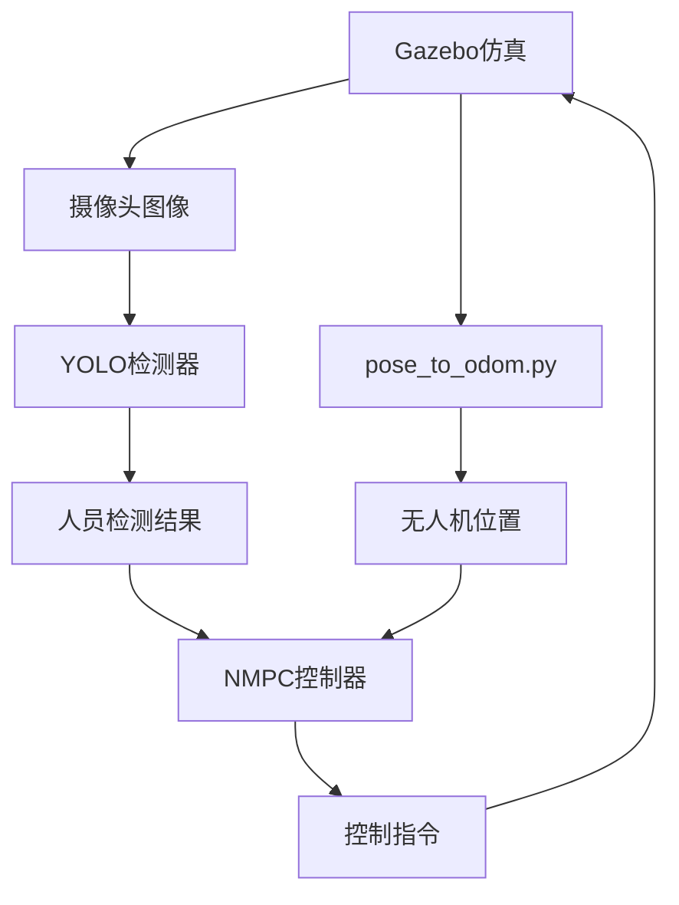

# 🚁 AVIANS ROS2: Autonomous Drone Mission Planning & Tracking System

     

## 📖 项目简介

AVIANS ROS2 是一个基于ROS2 Jazzy的**自主无人机任务规划、执行与跟踪系统**。该系统集成了LLM大语言模型任务规划、YOLO目标检测、NMPC非线性模型预测控制、PX4硬件集成和Gazebo物理仿真，实现了从任务规划到执行的全栈自主飞行能力。

### 🎯 核心功能
- **🤖 LLM任务规划**: 基于大语言模型的自然语言任务规划
- **📋 任务执行引擎**: 行为树风格的YAML任务编排系统
- **🛸 高级任务模块**: 起飞、盘旋、搜索、检查、降落等高级动作
- **🔍 实时目标检测**: 基于YOLO v12的深度学习目标检测
- **🎮 NMPC智能控制**: 非线性模型预测控制器实现精准轨迹跟踪
- **🔗 PX4硬件集成**: 通过uXRCE-DDS桥接真实Pixhawk 6X飞控
- **📹 视觉导航**: 摄像头始终对准跟踪目标
- **🌍 物理仿真**: Gazebo Harmonic高精度仿真环境
- **🔄 智能搜索**: 未检测到目标时自动旋转搜索
- **📊 实时可视化**: RViz2状态显示和轨迹可视化

## 🖥️ 系统要求

### 硬件要求
- **CPU**: Intel i5 或 AMD Ryzen 5 及以上
- **内存**: 最低8GB，推荐16GB
- **显卡**: 支持OpenGL的独立显卡（推荐）
- **存储**: 至少15GB可用空间

### 软件要求
- **操作系统**: Ubuntu 24.04 LTS (Noble Numbat)
- **ROS版本**: ROS2 Jazzy Jalopy
- **仿真环境**: Gazebo Harmonic
- **Python**: 3.12+
- **Conda**: Miniconda/Anaconda

## 🚀 一键安装 (新电脑推荐)

### 自动安装脚本

我们提供了**完整的一键安装脚本**，包含所有依赖项：

```bash
# 1. 克隆仓库
git clone https://github.com/zuoyangjkpi/AVIANS_ROS2.git
cd AVIANS_ROS2

# 2. 运行一键安装脚本
chmod +x .setup_avians_ros2_complete.sh
./.setup_avians_ros2_complete.sh

# 3. 重启终端或重新加载环境
source ~/.bashrc

# 4. 测试安装
./test_avians_complete.sh
```

### 安装内容包括：
- ✅ Ubuntu 24.04 系统更新和基础工具
- ✅ Miniconda 和 airship_ros2 环境（Python 3.12）
- ✅ ROS2 Jazzy Desktop 完整安装
- ✅ Gazebo Harmonic 仿真环境
- ✅ ROS2-Gazebo 集成包
- ✅ Python 依赖 (numpy, scipy, opencv, ultralytics, pyyaml, requests 等)
- ✅ ONNX Runtime 1.20.1
- ✅ YOLO 模型和标签文件
- ✅ 18个ROS2功能包构建（含任务规划、执行、PX4桥接）
- ✅ 项目环境自动配置
- ✅ 无人机运动问题修复

## 🎮 快速开始

### 基本使用流程

1. **激活环境**:
```bash
source ~/.bashrc
cd ~/AVIANS_ROS2
```

2. **运行综合测试系统**:
```bash
./comprehensive_test_suite.sh
```

3. **选择测试选项**:
```
📋 Test Options:
1) 🔍 System Status Check          # 系统状态检查
2) 🎮 Launch Gazebo Simulation     # 启动Gazebo仿真
3) 🧠 Test YOLO Detector          # 测试YOLO检测器
4) 📡 Monitor All Topics          # 监控所有话题
5) 🎯 Full Integration Test       # 完整集成测试 ⭐️
6) 🚁 NMPC Person Tracking Test   # NMPC人员跟踪测试
7) 🎮 NMPC + Gazebo Visual        # 可视化跟踪测试
8) 🧹 Kill All ROS Processes      # 清理所有进程
```

4. **推荐选项5** - 完整集成测试，包含所有功能！

### 如果无人机不动的解决方案

如果遇到无人机掉落或不动的问题，在**另一个终端**运行：

```bash
# 终端1: 运行pose转换器（解决odometry数据问题）
cd ~/AVIANS_ROS2
python3 ./pose_to_odom.py &

# 终端2: 运行主程序
./comprehensive_test_suite.sh
# 选择选项5
```

## 🏗️ 项目架构

### 核心包结构

```
AVIANS_ROS2/
├── 📁 src/
│   ├── 🤖 neural_network_detector/        # YOLO检测器
│   ├── 🚁 drone_description/              # 无人机模型和仿真
│   ├── 🎯 drone_nmpc_tracker/             # NMPC控制器
│   ├── 🎮 drone_guidance_controllers/     # 航点和偏航控制器
│   ├── ⚙️ drone_low_level_controllers/    # 底层速度控制适配器
│   ├── 📊 drone_state_publisher/          # 状态发布器
│   ├── 🧠 manual_mission_planner/         # LLM任务规划器
│   ├── 📋 mission_executor/               # 任务执行引擎
│   ├── 🛸 mission_action_modules/         # 高级任务动作模块
│   ├── 🔗 px4_bridge/                     # PX4硬件桥接
│   ├── 📨 custom_msgs/                    # 自定义消息类型
│   │   ├── neural_network_msgs/          # 神经网络消息
│   │   ├── uav_msgs/                     # 无人机消息
│   │   └── px4_msgs/                     # PX4消息
│   ├── 📊 target_tracker_distributed_kf/  # 卡尔曼滤波跟踪
│   ├── 📐 projection_model/               # 投影模型
│   ├── 🔄 tf_from_uav_pose/               # TF转换
│   ├── 📦 pose_cov_ops_interface/         # 协方差操作接口
│   └── 🔧 ros2_utils/                     # ROS2工具包
├── 📄 comprehensive_test_suite.sh         # 主测试脚本
├── 🔧 .setup_avians_ros2_complete.sh     # 一键安装脚本
├── 🐍 pose_to_odom.py                     # Odometry修复脚本
├── 📖 README.md                           # 本文档
└── 📖 README_SIMULATION.md                # 仿真详细指南
```

### 关键组件

| 组件 | 功能 | 状态 |
|------|------|------|
| **LLM任务规划器** | 自然语言转YAML任务计划 | ✅ 工作 |
| **任务执行引擎** | 行为树风格的任务调度和执行 | ✅ 工作 |
| **任务动作模块** | 起飞、搜索、检查、降落等高级动作 | ✅ 工作 |
| **YOLO检测器** | 实时目标检测和边界框生成 | ✅ 工作 |
| **NMPC控制器** | 非线性模型预测控制，实现精准轨迹跟踪 | ✅ 工作 |
| **PX4桥接** | 通过uXRCE-DDS连接Pixhawk硬件 | ✅ 工作 |
| **航点控制器** | 航点导航和偏航角控制 | ✅ 工作 |
| **Gazebo仿真** | 3D物理仿真环境 | ✅ 工作 |
| **RViz可视化** | 实时状态和轨迹显示 | ✅ 工作 |
| **Odometry桥接** | 位置数据转换（修复无人机不动问题） | ✅ 工作 |

## ⚙️ 详细配置

### 1. YOLO检测器配置

编辑检测器参数：
```bash
# 模型文件位置
./src/neural_network_detector/third_party/YOLOs-CPP/models/yolo12n.onnx

# 标签文件位置  
./src/neural_network_detector/third_party/YOLOs-CPP/quantized_models/coco.names
```

### 2. NMPC控制器参数

主要参数文件：`src/drone_nmpc_tracker/drone_nmpc_tracker/config.py`

```python
# 跟踪参数
ORBIT_RADIUS = 3.0          # 圆周轨迹半径(米)
ORBIT_HEIGHT = 2.5          # 跟踪高度(米)  
SEARCH_ANGULAR_SPEED = 0.5  # 搜索角速度(弧度/秒)

# 控制参数
TOPIC_DRONE_STATE = '/X3/odometry'      # 无人机状态话题
TOPIC_CMD_VEL = '/X3/cmd_vel'           # 控制指令话题
TOPIC_PERSON_DETECTIONS = '/person_detections'  # 检测结果话题
```

### 3. Gazebo仿真配置

仿真环境配置：`src/drone_description/worlds/drone_world.sdf`
- 无人机起始位置：(3, 0, 2.5)
- 摄像头配置：640x480分辨率，30FPS
- 物理引擎：Harmonic with bullet physics

## 🔍 工作原理

### 系统工作流程



### 控制逻辑

1. **检测到人员**：
   - 计算人员相对位置
   - 规划圆周轨迹
   - 控制摄像头始终对准目标
   - 保持设定的轨道半径和高度

2. **未检测到人员**：
   - 进入搜索模式
   - 原地旋转搜索
   - 发布搜索状态信息

## 🧪 测试和验证

### 系统测试选项

```bash
./comprehensive_test_suite.sh
```

各选项说明：

| 选项 | 功能 | 适用场景 |
|------|------|----------|
| **1** | 系统状态检查 | 验证所有组件是否正常 |
| **2** | 启动Gazebo | 单独测试仿真环境 |
| **3** | YOLO检测测试 | 验证目标检测功能 |
| **4** | 话题监控 | 检查ROS2通信状态 |
| **5** | ⭐ 完整集成测试 | 端到端系统验证 |
| **6** | NMPC跟踪测试 | 单独测试控制器 |
| **7** | 可视化跟踪 | 图形化跟踪演示 |

### 性能指标

- **检测延迟**: <100ms
- **控制频率**: 4Hz
- **跟踪精度**: ±0.5m
- **搜索响应**: <2秒
- **仿真帧率**: 60FPS

## 🐛 故障排除

### 常见问题及解决方案

#### 1. 无人机掉落或不动
```bash
# 问题：odometry数据缺失
# 解决方案：启动位置转换器
python3 ./pose_to_odom.py &
```

#### 2. RViz启动失败
```bash
# 问题：显示配置问题
# 解决方案：设置软件渲染
export LIBGL_ALWAYS_SOFTWARE=1
export GALLIUM_DRIVER=llvmpipe
```

#### 3. YOLO模型缺失
```bash
# 重新下载YOLO模型
cd src/neural_network_detector/third_party/YOLOs-CPP/models/
python3 -c "
from ultralytics import YOLO
model = YOLO('yolov8n.pt')
model.export(format='onnx')
"
```

#### 4. 构建错误
```bash
# 清理并重新构建
rm -rf build/ install/ log/
colcon build --symlink-install
```

#### 5. 话题通信问题
```bash
# 检查ROS2话题
ros2 topic list
ros2 topic echo /X3/odometry --once
ros2 topic echo /person_detections --once
```

## 🔧 开发指南

### 添加新功能

1. **扩展检测类别**：
   - 修改YOLO标签文件
   - 更新检测器配置
   - 调整控制逻辑

2. **优化跟踪算法**：
   - 修改NMPC参数
   - 调整轨迹规划
   - 更新状态估计

3. **集成新传感器**：
   - 添加传感器模型到Gazebo
   - 创建ROS2接口
   - 更新融合算法

### 代码结构

```bash
# C++包结构
src/package_name/
├── CMakeLists.txt
├── package.xml
├── include/package_name/
├── src/
└── config/

# Python包结构  
src/package_name/
├── setup.py
├── package.xml
├── package_name/
└── config/
```

## 📊 性能优化

### 系统优化建议

1. **GPU加速**：
   - 启用CUDA支持
   - 使用GPU版本的ONNX Runtime
   - 优化内存管理

2. **网络优化**：
   - 调整ROS2 QoS配置
   - 使用压缩图像传输
   - 优化话题频率

3. **算法优化**：
   - 减小YOLO输入分辨率
   - 调整检测置信度阈值
   - 优化控制器参数

## 📚 API参考

### 主要话题

| 话题名称 | 消息类型 | 描述 |
|----------|----------|------|
| `/camera/image_raw` | `sensor_msgs/Image` | 摄像头原始图像 |
| `/person_detections` | `neural_network_msgs/NeuralNetworkDetectionArray` | 人员检测结果 |
| `/X3/odometry` | `nav_msgs/Odometry` | 无人机位置信息 |
| `/X3/cmd_vel` | `geometry_msgs/Twist` | 无人机控制指令 |
| `/X3/enable` | `std_msgs/Bool` | 无人机使能信号 |

### 主要服务

| 服务名称 | 服务类型 | 描述 |
|----------|----------|------|
| `/nmpc/reset` | `std_srvs/Empty` | 重置NMPC控制器 |
| `/detector/configure` | `std_srvs/SetParameters` | 配置检测器参数 |

## 🤝 贡献指南

欢迎贡献代码！请遵循以下步骤：

1. Fork本仓库
2. 创建特性分支 (`git checkout -b feature/amazing-feature`)
3. 提交更改 (`git commit -m 'Add amazing feature'`)
4. 推送到分支 (`git push origin feature/amazing-feature`)
5. 创建Pull Request

### 代码规范
- 遵循ROS2编码标准
- 添加适当的注释和文档
- 包含单元测试
- 保持向后兼容性

## 📄 许可证

本项目采用Apache License 2.0许可证 - 详见 [LICENSE](LICENSE) 文件

## 🙏 致谢

- ROS2社区提供的优秀中间件
- Ultralytics团队的YOLO实现
- Gazebo仿真平台开发团队
- ONNX Runtime优化团队

## 📞 支持与联系

- **GitHub Issues**: [提交问题](https://github.com/zuoyangjkpi/AVIANS_ROS2/issues)
- **GitHub Discussions**: [讨论交流](https://github.com/zuoyangjkpi/AVIANS_ROS2/discussions)
- **技术文档**: 查看仓库中的技术文档（MISSION_PIPELINE_PLAN.md、PX4_INTEGRATION_GUIDE.md等）

## 🎯 未来计划

- [ ] 多无人机协同任务执行
- [ ] 深度学习轨迹预测
- [ ] 更多PX4实际硬件平台测试
- [ ] Web界面控制台
- [ ] 移动端监控应用
- [ ] 增强LLM任务规划能力

---

<div align="center">

**🚁 为自主航空系统而构建 ❤️**


*无人机智能跟踪系统演示*

</div>

---

## 📈 版本历史

### v2.0.0 (当前版本)
- ✅ 完整的ROS2 Jazzy移植
- ✅ Gazebo Harmonic集成
- ✅ YOLO v12目标检测
- ✅ NMPC精准轨迹跟踪
- ✅ LLM任务规划器（支持千问API）
- ✅ 任务执行引擎和高级动作模块
- ✅ PX4硬件集成（Pixhawk 6X HITL）
- ✅ 航点导航和偏航控制
- ✅ 一键安装脚本（18个包）
- ✅ 完整的测试套件

### v1.0.0 (初始版本)
- ✅ 基础人员跟踪功能
- ✅ NMPC圆周轨迹跟踪
- ✅ 仿真环境搭建

### 即将发布的功能
- 🔄 实时轨迹优化
- 🔄 多目标跟踪支持
- 🔄 机器学习轨迹预测
- 🔄 多无人机协同
- 🔄 云端部署支持